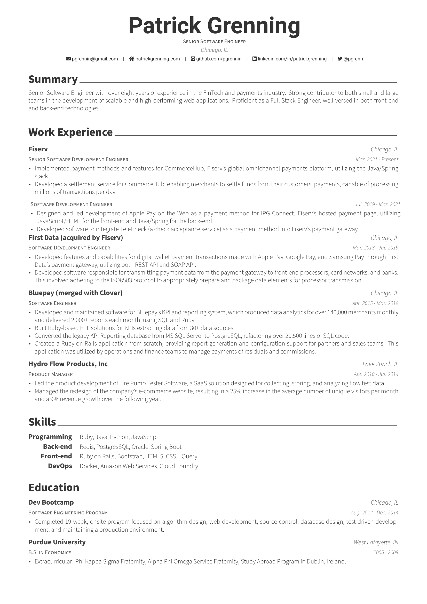

## Overview

My resume based off the [Awesome-CV](https://github.com/posquit0/Awesome-CV) template. 

## How to Run

The following script I created  will generate the resume in a docker container.

```bash run.sh```

## My Resume

[PDF Resume](examples/patrick_grenning_resume.pdf)



